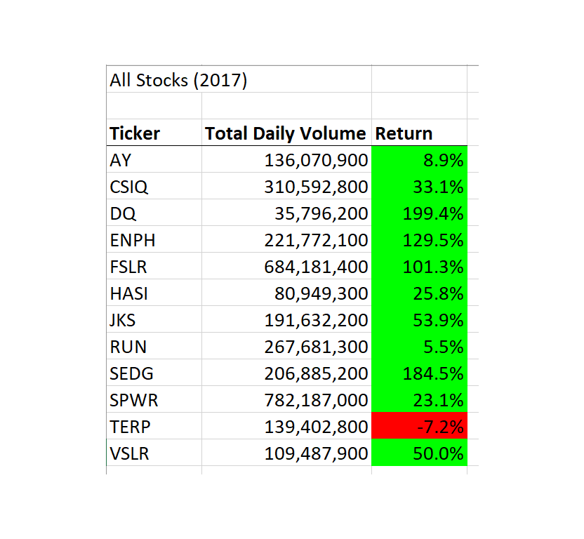
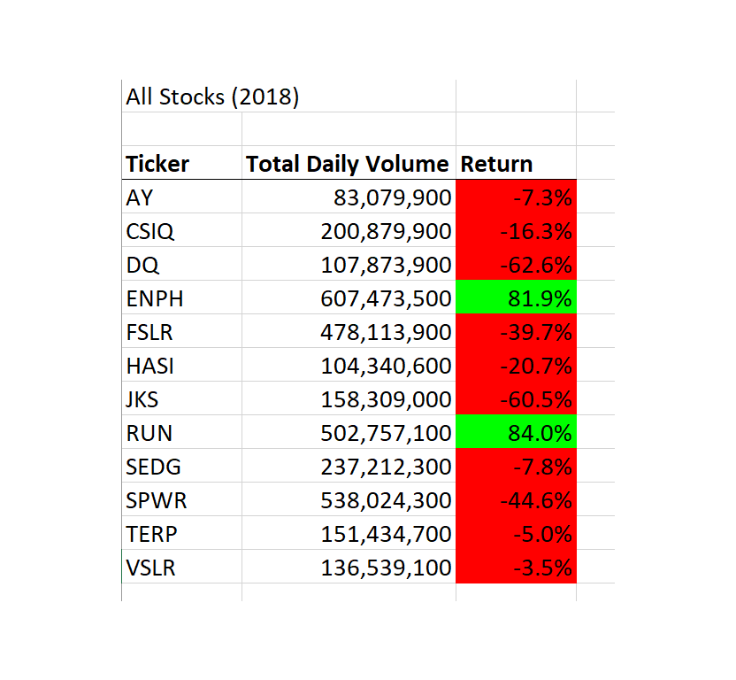
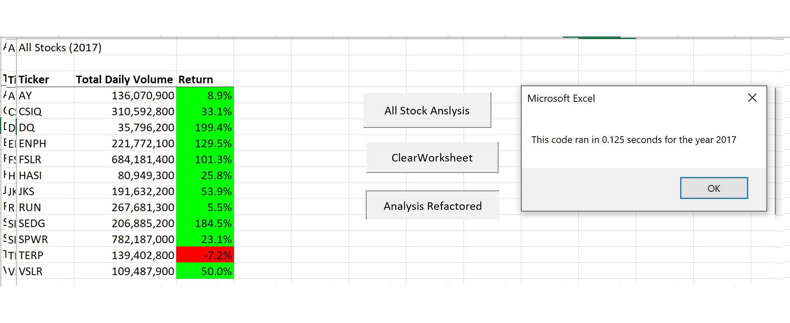
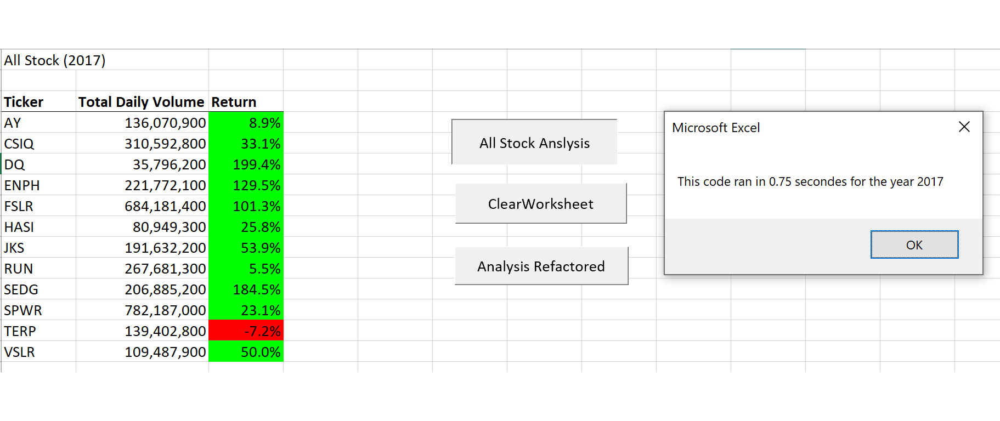
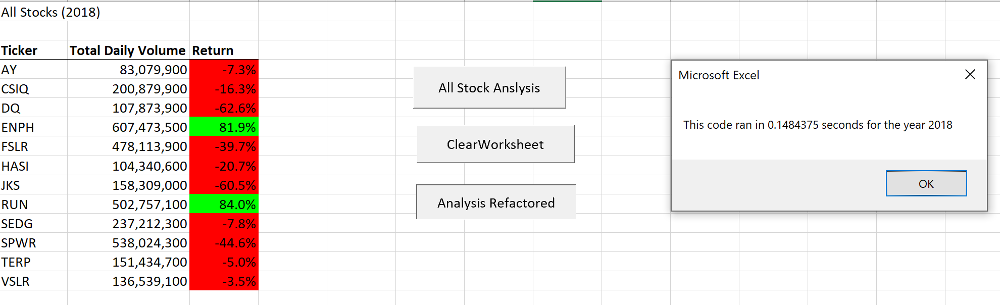
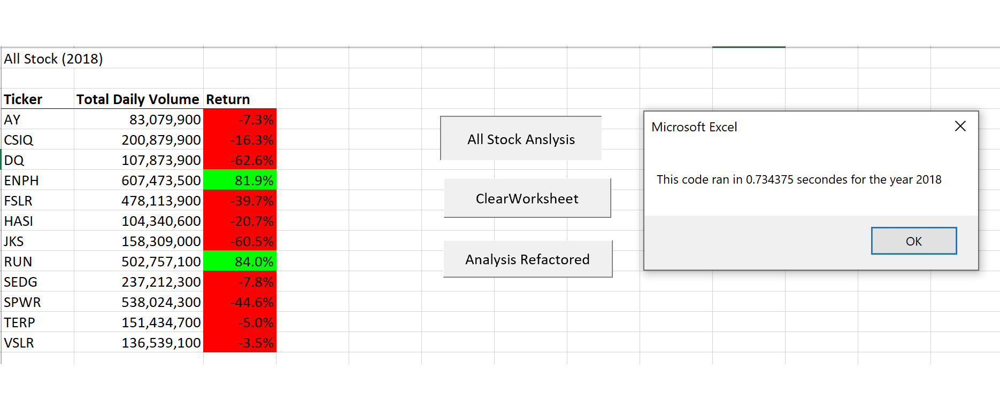
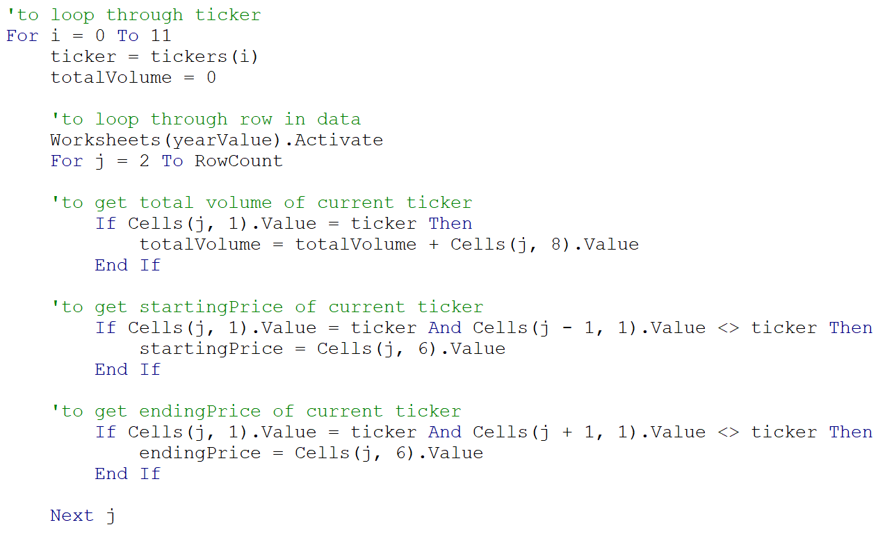
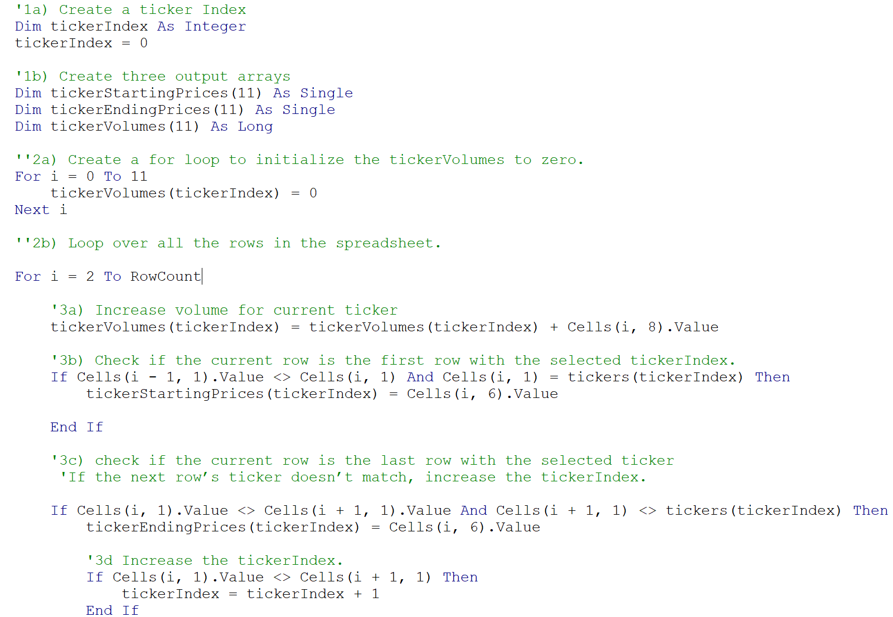
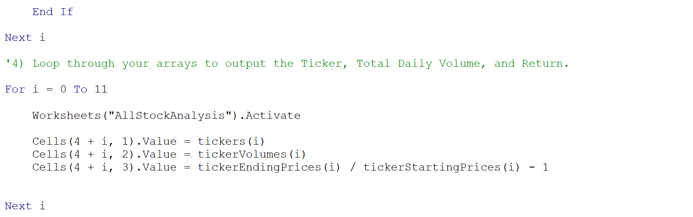

# stock-analysis
Performing analysis on twelve stocks by comparing their daily trading volumes and returns in year 2017 and 2018.

## Overview of the project
This project is to refactor the code on AllStockAnalysis.

### Purpose
By refactoring the code, we should get the same result as AllStockAnalysis within less execution time. We should be able to compare the stock performance and identify the potential stock for investment.

## Results

### Stock Performance
By comparing the total daily volume and return, I conclude that 2017 is a better year as it shows more daily trading volume and higher return than 2018. The only exception is TERP. TERP’s return improved a little from -7.2% to -5% but remained in negative return. RUN’s return improved a lot from 5.5% to 84%. 

### Code Performance
The refactored code has less execution time is therefore more efficient. It has variable as tickerIndex and used this ticker as an index to pull information. The original code had a nested loop whereas the refactored code doesn’t, which improved the performance.

#### Code Performance for 2017

#### Code Performance for 2018

## Summary

### Refactoring Code Advantage and Disadvantage

In general refactoring code has a clearer pattern and makes debugging easier, thus making the code more maintainable. It improves performance and uses less memory. 

There are several disadvantages of refactoring. When refactoring the code, we need to restart to write the codes and thus requires longer time in writing the code. And it may introduce new bugs when writing a longer and more complicated codes. 

### Refactoring Code on This Project

There are two advantages of the refactored VBA project. First it improved code performance through reduced execution time. Second it reduced the use of nested loop, making the coding logic clearer.

 

**Nested Loops on Original Script**
 

 

**Refactored Scripts with no Nested Loop**
 

I personally found two disadvantages on the refactored VBA project. First it requires a strong logic to write a longer and more complicated code. It is difficult for a beginner. Second I personnally encountered many errors to debug compared to the nested loop, and it takes a lot of time.

